# Architecture — EPMCDMETST-66948

## Purpose and scope

This architecture describes two independent test targets orchestrated by GitHub Actions:

- The API suite targets the public Restful Booker API at `https://restful-booker.herokuapp.com`.
- The UI suite targets a private, ephemeral instance provisioned for the CI run from the official Restful Booker Platform source repository, pinned to immutable commit `d36bd3f8647a091d406e53bad463c5e3e5d2ece1`.

The API and UI are separate applications with separate data stores. UI tests use only the per-run private UI instance and never rely on API-created booking data. The shared public UI at `https://automationintesting.online` is not a mutating test target and is never used as a fallback.

## Components and responsibilities

### GitHub Actions workflow

- Runs separate API and UI test jobs in parallel and publishes separate, clearly labeled TRX results. All uploaded reports and failure artifacts are retained for 7 days.
- Uses two trust tiers: `pull_request` validation runs without privileged credentials; credentialed integration runs are limited to trusted-branch events or manual runs. PR-controlled code must not execute in a job with privileged secrets.
- Sets workflow-level `permissions: {}` and grants only `contents: read` to jobs that check out repository content. Pins every third-party action to a reviewed full commit SHA.
- Uses a fixed `ubuntu-24.04` runner baseline and reviewed, full-SHA-pinned setup actions to install and verify JDK 26, Maven 3.9.14, Node 24.14.1, and npm 11.11.0.
- Makes GitHub Environment secrets available only to approved trusted integration jobs after the environment's required-reviewer gate.
- Keeps public API live mutation in a dedicated trusted/manual workflow lane, separate from secret-free pull-request validation. D4 permits these runs only after the reviewer-gated environment approval and serializes them so no more than one live-mutation run is active at a time.
- Invokes each suite through `dotnet test`.
- Checks out the UI source at the approved immutable commit, provisions an isolated instance for the CI run, supplies its private base URL to the UI test job, and tears the instance down after UI execution on success or failure.
- Installs the required Playwright browser dependencies and supplies external runtime configuration/secrets without committing credentials.
- Fails the UI job with diagnostics if provisioning/readiness fails; it does not redirect tests to the shared public UI. A separately labeled, bounded provisioning-diagnostics artifact is uploaded only for these UI environment failures and only after sanitization.
- Publishes a separately labeled API or UI test report; masked UI failure screenshots are allowed, while Playwright traces and videos are disabled. Do not publish diagnostics that cannot be safely sanitized.

Candidate full action SHAs identified for review are `actions/checkout@11d5960a326750d5838078e36cf38b85af677262` (v4), `actions/setup-java@b6effb05e454b25005698d916606bdc6ffcbf961` (v5), and `actions/setup-node@49933ea5288caeca8642d1e84afbd3f7d6820020` (v4). These remain candidates until their release provenance and suitability are reverified during implementation. Exact workflow events/branch names, GitHub Environment name/reviewer configuration, final action pins, toolchain setup/verification implementation, exact permission exceptions, public API serialization mechanism, credential/configuration names, teardown command/post-step guarantee, and cleanup after abrupt runner loss or hard termination: **Not Found**.

### UI environment provisioner

- Checks out the official source at `d36bd3f8647a091d406e53bad463c5e3e5d2ece1` and builds/starts an isolated platform instance for the CI run.
- Uses Docker Compose with a unique project name for each CI run. A runtime-only Compose override publishes only the frontend container's port 80 on an OS-assigned host port bound to `127.0.0.1`; backend services remain on the project's private network and are not host-published.
- Retains each service's embedded H2 database, leaves H2 TCP ports unpublished, and does not enable `dbServer`. Supplies the UI test suite with a base URL formed from the discovered frontend port rather than assuming `localhost:3003`.
- Cleans up resources by targeting only that run's Compose project. It does not use the upstream interactive launcher or process-wide cleanup.
- Uses the upstream-documented toolchain: JDK 26 or higher (tested with JDK 26), Maven 3.9.14, Node 24.14.1, and npm 11.11.0.
- Supplies the private instance's UI base URL and required runtime configuration to that run's UI test job.
- Requires all six backend Actuator health endpoints (`/booking/actuator/health`, `/room/actuator/health`, `/branding/actuator/health`, `/auth/actuator/health`, `/report/actuator/health`, and `/message/actuator/health`) and the frontend root `/` to be ready before UI tests begin. The approved probe-image approach is to reuse the digest-pinned Node image already used by the UI source and use Node's built-in HTTP client; no separate probe image is required. The exact command and runtime network-attachment mechanism remain **Not Found**. Upstream Compose has no healthchecks, so running state or `docker compose up --wait` alone does not establish application readiness.
- Bounds the combined image build, environment start, and readiness phase to 20 minutes. Exceeding the bound fails the phase and enters failure diagnostics and teardown.
- Collects bounded, run-scoped diagnostics on build, provisioning, readiness, or UI test failure, including sanitized Compose status/log summaries and each readiness endpoint's last observed response summary. Uploads a separately labeled provisioning-diagnostics artifact only for UI environment build/provisioning/readiness failures; diagnostics for UI test failures are not published as that artifact. Does not dump environment variables or secrets; excludes raw network bodies/headers, Docker inspection/configuration output, and unredacted logs. Diagnostics that cannot be safely sanitized are not published. Uploaded diagnostics follow the 7-day artifact retention policy. Artifact destination, quantitative bounds, implementation, and runtime verification are **Not Found**.
- Attempts project-scoped teardown after success, test failure, partial provisioning/readiness failure, and cancellation using an `always()` post-step. GitHub Actions cancellation can forcibly terminate a job after its cancellation timeout, so this is best-effort cleanup, not a guarantee. If tests pass but teardown fails, the job fails; if an earlier failure already occurred, that primary failure is preserved and teardown failure is reported separately.

The pinned root README documents the UI tool versions. The upstream `docker-compose.yml` has fixed host-port mappings. The runtime-only override must use Compose `!override` to replace inherited `ports` sequences rather than append mappings, and must leave only the frontend's dynamically assigned `127.0.0.1` host port published. Compose `!override` requires Compose 2.24.0 or later. The pinned `ubuntu-24.04` runner inventory examined during discovery reported Compose 2.38.2; this is an observed candidate baseline, not a guarantee, so implementation must check the installed version and fail before provisioning if it lacks `!override`. It must inspect the merged Compose model programmatically and fail unless exactly the intended frontend mapping is present and backend/H2 ports are unpublished; do not print raw Compose configuration into logs or artifacts.

The upstream `run_locally.cmd` starts background processes, waits interactively, and invokes process-wide `taskkill`; it is not used for CI. The `ubuntu-24.04` runner does not provide the full required JDK/Maven/Node/npm versions by default, so the workflow must install and verify the exact toolchain. Candidate immutable base-image references identified for the pinned source are `eclipse-temurin:26-jre-alpine@sha256:9eedff2367194d11eddd6f14101b444945a708c986270cd5716b934596ba3a31` and `node:24.14.1@sha256:80fc934952c8f1b2b4d39907af7211f8a9fff1a4c2cf673fb49099292c251cec`. After checking out the approved source SHA, a guarded CI-only rewrite may replace the expected floating `FROM` references with these digests; it must fail if the source references or expected occurrence counts differ, and verify that no floating base-image references remain before building. The Maven 3.9.14 archive candidate has SHA-512 `d50af8ab5e6005b46a07f0ce9d3719e67cfdf898da988a84871304cd59fb1af0fef2f99dea709e6e66f21f732f905979b5c2dce6b6860406f60a70e84d9cf0b8`; verify this checksum before extraction. These pins/checksums are discovery candidates and require revalidation before use.

Final action/toolchain setup configuration, Compose runner version/permissions, environment/reviewer configuration, runtime credentials, exact probe command/network-attachment mechanism, diagnostics artifact destination/quantitative bounds, cleanup after abrupt runner loss or hard termination, public API credential authorization, current service stability/rate/reset behavior, and live-mutation serialization mechanism: **Not Found**.

### API test suite

- A C#/.NET 8 NUnit test suite using RestSharp to call the public Restful Booker API.
- Obtains and reuses an auth token for dependent tests.
- Exercises API booking creation, retrieval, update, patch, deletion, and specified expected error responses.
- Creates and cleans up its own API-side test booking data.
- Emits a machine-readable API TRX report separate from UI results, retained for 7 days. Does not log credentials, authentication tokens, or raw API response bodies; configured credentials, authentication tokens/cookies, booking values, and run markers are redacted from reports and diagnostics.
- Live create/update/PATCH/delete checks run only in the dedicated trusted/manual lane after reviewer approval; ordinary pull-request validation does not receive API credentials.
- Each live run uses synthetic, non-sensitive booking data and a unique high-entropy run marker. It may read or mutate only the exact booking ID returned by that run's successful create. It never lists bookings or selects arbitrary IDs. Before destructive operations, it reads the same-run ID and verifies the run marker; missing or mismatched ownership aborts further mutation.
- An uncertain create outcome aborts without retrying or guessing an ID. Automatic retries are disabled for POST, PUT, PATCH, and DELETE. After successful creation with a known ID, cleanup is attempted in a `finally` path. Cleanup failure fails an otherwise successful job; if another failure is already primary, preserve it and report cleanup failure separately.
- Authorized live API credentials are sourced only from `RESTBOOKER_API_USERNAME` and `RESTBOOKER_API_PASSWORD` GitHub Environment secrets in the reviewer-gated `restbroker-live-api-mutations` environment. The service owner must provision the authorized secret values; no defaults are used.
- Serialize the dedicated manual mutation lane with repository-wide GitHub Actions concurrency group `restbroker-live-api-mutations` and `cancel-in-progress: false`. Keep the mutation fixture explicit and fail-closed until the workflow enforces this group and all other gates.
- Each run generates a fresh 128-bit cryptographically random marker in the existing `additionalneeds` field. Mask the marker and any known booking ID. On uncertain create or failed cleanup, ordinary logs/reports/artifacts may include only a sanitized run URL/ID, attempt, time window, and failure category. Exact marker and known ID may be sent only through a restricted incident channel approved and provided by the service owner.
- The incident-channel platform/integration and owner-provided credentials are **Not Found**. Until that recovery integration is configured and verified, authorized GitHub Environment credentials are provisioned, and the serialized reviewer-gated workflow is implemented, live mutations remain disabled. The current I5 scaffolding rejects execution before any request.
- Current public-service availability, rate limits, reset behavior, persistence guarantees, and credential authorization are **Not Found**. Whether non-mutating live API checks run during pull-request validation is **Not Found**.

### UI test suite

- A C#/.NET 8 NUnit test suite using Playwright, runnable through `dotnet test`.
- Runs headless Chromium at 1280×720 in CI by default; browser and viewport remain configurable, and headed local execution is available.
- Uses Playwright to browse rooms, submit the public booking workflow, and verify confirmation only against the private UI instance supplied for that run.
- Does not mutate or use the shared public UI, does not depend on the public API's bookings, and does not fall back to another environment if provisioning/readiness fails.
- Captures a failure screenshot with sensitive fields masked and emits a separate UI TRX report; both are retained for 7 days. Uses only synthetic test values; credentials, authentication tokens/cookies, booking values, and run markers are redacted from reports, diagnostics, and screenshots. Playwright traces and videos are disabled.

The Playwright .NET package/version and exact runtime configuration names: **Not Found**.

### External systems and runtime inputs

- **Restful Booker public API (`restful-booker.herokuapp.com`):** external API used only by the API suite.
- **Official Restful Booker Platform source:** `mwinteringham/restful-booker-platform` at immutable commit `d36bd3f8647a091d406e53bad463c5e3e5d2ece1`.
- **Ephemeral private UI instance:** a per-run Docker Compose project containing the UI, backend services, and their embedded data stores. Only the frontend is published, on a dynamically assigned loopback host port; backend and H2 TCP ports remain private. Docker Engine/Compose runner availability and probe-container details: **Not Found**.
- **Runtime configuration and CI secrets:** provide API/UI base URLs, credentials, booking data, browser, viewport, and any private-instance inputs; sensitive values remain external to committed files. Public API credentials are available only to the approved trusted/manual integration lane through reviewer-gated GitHub Environment secrets. Exact secret names and credential authorization are **Not Found**.

Exact runtime input names/formats, private UI credentials, trusted branch/event names, GitHub Environment configuration/reviewers, and ports: **Not Found**.

## Data flow and lifecycle

1. GitHub Actions starts independent API and UI jobs in parallel and coordinates the run-specific UI environment lifecycle.
2. The API test lanes remain distinct: pull-request validation is secret-free and does not perform live mutation; trusted/manual integration may use reviewer-gated credentials to run live API mutation tests under the ownership, serialization, no-retry, and cleanup safeguards specified above. RestSharp sends authentication and booking requests to `https://restful-booker.herokuapp.com`. Whether non-mutating public API checks run on pull requests is **Not Found**.
3. The UI lifecycle checks out the immutable source revision and starts it under a unique Docker Compose project name using a runtime-only override. The override publishes only the frontend's container port 80 on an OS-assigned host port bound to `127.0.0.1`; backend services communicate over the project's private network. CI discovers the assigned frontend port and passes the resulting base URL to the UI suite. Before UI tests, a short-lived probe container on the private Compose network checks all six backend Actuator health endpoints, while CI checks frontend `/`; no backend ports are published. Probe image/source/provenance/digest and network-attachment mechanism are **Not Found**. The combined image build, start, and readiness phase is bounded to 20 minutes. On build, provisioning, readiness, or UI test failure, collect bounded, run-scoped diagnostics with sanitized Compose status/log summaries and endpoint response summaries, without dumping environment values or secrets. Publish a separate provisioning-diagnostics artifact only for UI environment failures, never for UI test failures; destination and quantitative bounds are **Not Found**. Provisioning/readiness failure fails clearly and does not access the shared public UI.
4. The UI job launches Chromium through Playwright, navigates only to the private per-run UI, browses rooms, submits a booking, and verifies confirmation against that instance's own backend and data store.
5. CI attempts teardown only for that run's Compose project after success, test failure, partial provisioning/readiness failure, and cancellation, using a cancellation-safe post-step. If tests passed but teardown fails, the job fails; if another failure already occurred, that primary failure is preserved and teardown failure is reported separately. Cleanup after abrupt runner loss or hard termination is **Not Found**.
6. API and UI jobs publish separate TRX results. Uploaded reports, masked UI failure screenshots, and separately labeled provisioning-diagnostics artifacts are retained for 7 days. UI environment build/provisioning/readiness failures may publish a bounded provisioning-diagnostics artifact only after sanitization. Use synthetic test values, redact configured credentials, authentication tokens/cookies, booking values, and run markers from reports, diagnostics, and screenshots, and never log raw API response bodies. Exclude raw network bodies/headers, environment dumps, Docker inspection/configuration output, and unredacted logs. If diagnostics cannot be safely sanitized, do not publish them. Artifact destination, quantitative bounds, implementation, and runtime verification are **Not Found**.

No booking state is shared between API and UI suites or across per-run UI environments. Unique Compose project names and dynamically assigned loopback frontend ports isolate the per-run containers and avoid fixed host-port collisions. Project-scoped cleanup prevents one run from terminating another run's resources. Docker/Compose runner permissions/version and cleanup after abrupt runner loss or hard termination remain **Not Found**.

## Technology decisions

- C# and .NET 8 for both test suites.
- RestSharp for API calls in the API suite.
- NUnit for test execution and assertions.
- Playwright for browser UI automation against the private per-run UI instance.
- GitHub Actions for parallel test execution and environment lifecycle orchestration.
- A fixed `ubuntu-24.04` runner baseline; workflow permissions default to `{}`, with `contents: read` granted only to checkout jobs. Third-party actions are pinned to reviewed full commit SHAs.
- Two CI trust tiers: secret-free pull-request validation and trusted-branch/manual integration runs. Reviewer-gated GitHub Environment secrets are limited to approved trusted integration jobs; exact event/branch/environment configuration remains **Not Found**.
- UI source build toolchain pinned by the upstream README: JDK 26 or higher (tested with JDK 26), Maven 3.9.14, Node 24.14.1, and npm 11.11.0.
- Reviewed, full-SHA-pinned setup actions install and verify those exact toolchain versions; exact action SHAs and setup implementation are **Not Found**.
- All base images must be digest-pinned before CI use; the enforcement mechanism for the pinned source's floating Dockerfile references is **Not Found**.
- Headless Chromium at 1280×720 as the configurable CI default.

The immutable upstream source revision is `d36bd3f8647a091d406e53bad463c5e3e5d2ece1`. Playwright .NET package version, API test dependency versions, artifact destination/quantitative bounds, exact configuration names, and workflow triggers: **Not Found**.

## Cross-cutting behavior

- Credentials and sensitive booking data remain external to committed files. D5 requires synthetic test values, redaction of configured credentials, authentication tokens/cookies, booking values, and run markers from reports and diagnostics, masked UI failure screenshots, and no publication of diagnostics that cannot be safely sanitized. Raw API bodies and network bodies/headers, environment dumps, Docker inspection/configuration output, and unredacted logs are excluded; Playwright traces and videos are disabled.
- API and UI suites use independent data stores and reports. Setup, test, cleanup, provisioning, and readiness failures are explicit; no silent retry or success-shaped fallback is permitted.
- UI data is isolated to a per-run ephemeral environment and does not collide with concurrent runs or external users.
- The shared public UI must never receive test booking mutations and must never be used as fallback.
- Workflow permissions default to `{}`; checkout jobs receive only `contents: read`, and reviewer-gated environment secrets are limited to trusted integration jobs. Exact event/branch/environment configuration and API credential names remain **Not Found**.

## Risks and unresolved requirements

- The approved provisioning approach is a unique Docker Compose project per CI run, with a runtime-only override publishing only the frontend on an OS-assigned loopback port. The upstream fixed-port mappings must be replaced; the interactive/process-wide-kill `run_locally.cmd` is not used. Embedded H2 databases remain per-service private state; H2 server mode and host-published H2 ports are not used.
- The approved workflow trust model is secret-free pull-request validation and trusted-branch/manual integration; workflow permissions default to `{}`, checkout jobs receive only `contents: read`, and third-party actions are pinned to reviewed full SHAs.
- The approved runner baseline is `ubuntu-24.04` with reviewed, full-SHA-pinned setup actions to install and verify exact tool versions. GitHub Environment secrets require reviewer approval and are limited to trusted integration jobs. Exact action SHAs, events/branch names, environment configuration/reviewers, and runtime credential names remain **Not Found**.
- All container base images must be digest-pinned before CI use. The enforcement mechanism for floating Dockerfile references in the pinned source is **Not Found**.
- Docker Engine/Compose runner permissions/version, probe-container image/provenance/digest and network attachment, runtime credentials, diagnostics artifact destination/quantitative bounds/implementation, and runtime verification are **Not Found**. The D5 redaction and 7-day retention policies are approved.
- Readiness requires all six backend Actuator health endpoints and frontend `/`; combined build/start/readiness is bounded to 20 minutes.
- Teardown is attempted after success, test failure, partial provisioning/readiness failure, and cancellation. Teardown failure fails an otherwise successful job and is reported separately if another failure is already primary. Cleanup after abrupt runner loss or hard termination is **Not Found**.
- Public API live mutation is restricted to a serialized, reviewer-approved trusted/manual lane with same-run ownership checks, synthetic data, no mutation retries, and finally cleanup. Exact concurrency mechanism, credential authorization, service stability/rate/reset behavior, and cleanup after abrupt runner loss remain **Not Found**.
- Exact runtime configuration names, report formats, and workflow triggers are **Not Found**.
- The exact toolchain installation/verification action SHAs and runtime verification on the selected runner are **Not Found**.

## Component Diagram

```mermaid
flowchart LR
  PR[Pull request code] -->|no privileged secrets| PRJob[Secret-free validation<br/>ubuntu-24.04]
  Trusted[Trusted branch or manual run] -->|reviewer approval| Env[GitHub Environment secrets]
  Trusted --> TrustedJob[Trusted integration<br/>ubuntu-24.04]
  Env -.->|only approved trusted job| TrustedJob
  PRJob --> Actions[Full-SHA-pinned actions<br/>least-privilege permissions]
  TrustedJob --> Actions
  Actions -->|install and verify exact toolchain| Toolchain[JDK 26, Maven 3.9.14<br/>Node 24.14.1, npm 11.11.0]
  Actions -->|parallel dotnet test jobs| API[NUnit API test suite]
  Actions -->|provision and project-scoped cleanup| Compose[Per-run Docker Compose project]
  Source[Official platform source<br/>pinned immutable commit] -->|digest-pinned image inputs required| Compose
  Compose -->|discover dynamic loopback frontend port| Actions
  Actions -->|run-specific base URL| UI[NUnit UI test suite]
  UI -->|Playwright browser automation| Browser[Headless Chromium]
  Browser -->|127.0.0.1 dynamic port to container port 80| Web[Per-run frontend]
  subgraph PrivateNetwork[Per-run private Compose network]
    Web -->|service DNS| UIBackend[Private backend services]
    UIBackend --> DB[Private embedded H2 data stores<br/>no H2 server ports]
    Probe[Short-lived digest-pinned probe container] -->|Actuator health checks| UIBackend
  end
  Compose -->|start/build and frontend readiness| Ready[Readiness gate<br/>20-minute combined bound]
  Probe --> Ready
  Ready -->|ready| UI
  Compose -->|build failure| Diagnostics[Sanitized bounded diagnostics]
  Ready -->|provision/readiness failure| Diagnostics
  UI -->|test failure| Diagnostics
  Diagnostics -->|UI environment failures only| DiagArtifact[Provisioning diagnostics artifact<br/>7-day retention]
  UI -->|test failure| UIScreenshot[Masked failure screenshot<br/>7-day retention]
  Diagnostics -->|preserve primary failure; report cleanup result| Teardown[Cancellation-safe project-scoped teardown]
  UI -->|success, failure, or cancellation| Teardown
  Compose -->|partial startup failure or cancellation| Teardown
  TrustedJob -->|serialized dedicated live-mutation lane| LiveAPI[Restful Booker API test lane]
  LiveAPI -->|RestSharp auth and same-run owned CRUD| PublicAPI[Restful Booker public API]
  LiveAPI -->|finally cleanup; no mutation retries| PublicAPI
  API --> APIReport[API TRX report<br/>7-day retention]
  UI --> UIReport[UI TRX report<br/>7-day retention]
  UI -->|test failure| UIReport
```

### Diagram legend

- **Secret-free validation job:** validates pull-request code without privileged secrets.
- **Trusted integration job / GitHub Environment secrets:** runs only for trusted-branch or manual events after required reviewer approval; exact event, branch, and environment configuration are **Not Found**.
- **Dedicated live-mutation lane:** serialized to one active run and available only to approved trusted/manual integration; uses same-run created booking IDs, verifies ownership markers before destructive operations, does not retry mutations, and attempts finally cleanup.
- **Full-SHA-pinned actions / least-privilege permissions:** checkout jobs receive only `contents: read`; workflow permissions default to `{}`.
- **Toolchain:** exact upstream-required JDK, Maven, Node, and npm versions installed and verified on `ubuntu-24.04`; exact setup action SHAs are **Not Found**.
- **Official platform source:** immutable source input used to build the private instance.
- **Per-run Docker Compose project:** builds/starts the pinned UI source under a unique project name; only the frontend is published to a dynamic loopback port, while backend services and embedded data stores stay private. Base images must be digest-pinned.
- **Probe container / readiness gate:** a short-lived probe container checks six backend Actuator endpoints on the private network while CI checks frontend `/`; combined build/start/readiness is bounded to 20 minutes. Probe image provenance/digest and network-attachment mechanism are **Not Found**.
- **Run-scoped diagnostics / provisioning artifact:** sanitized, bounded Compose status/log summaries and endpoint response summaries; the separately labeled artifact is only for UI environment build/provisioning/readiness failures. Do not publish diagnostics that cannot be safely sanitized; destination and quantitative bounds are **Not Found**.
- **Project-scoped teardown:** attempts cleanup after success, failure, partial startup, and cancellation; cleanup after abrupt runner loss or hard termination is **Not Found**.
- **NUnit API test suite / Restful Booker public API:** API test flow and its separate external target.
- **NUnit UI test suite / Headless Chromium:** UI runner and automated browser.
- **Per-run frontend / Run-specific backend services and embedded data stores:** isolated browser target and state for one run; backend ports are not published to the host.
- **API test report / UI test report and failure artifacts:** distinct TRX reports, masked UI failure screenshots, and any separately labeled sanitized provisioning-diagnostics artifacts are retained for 7 days. Playwright traces and videos are disabled; provisioning diagnostics are limited to UI environment failures.
